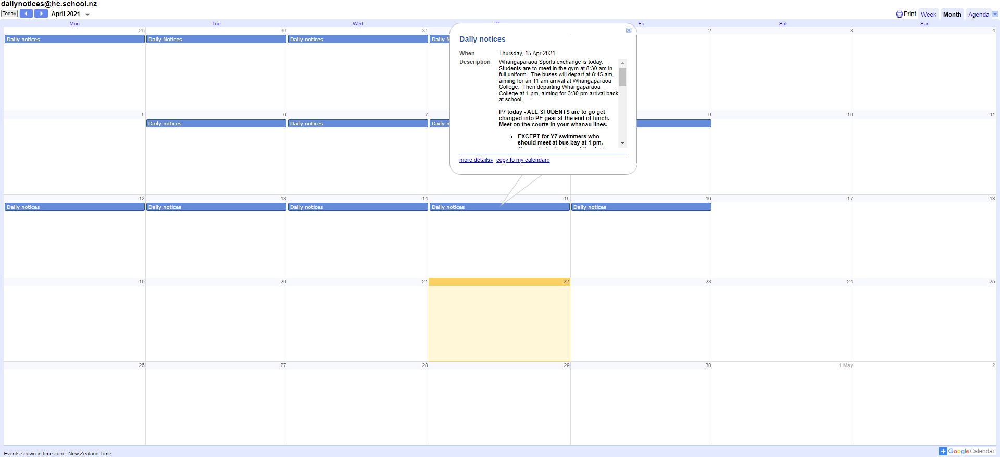

### Unofficial Huanui College daily notices reader, because your eyes matter.

 

> #### [Github: https://github.com/Fallstop/HCNoticeReader](https://github.com/Fallstop/HCNoticeReader)

> #### [Website: https://hcnotices.jmw.nz/](https://hcnotices.jmw.nz/)

 

## Framework

This static "webapp" is built in [Svelte](https://svelte.dev/), and leans of my previous [HC Api Platform](/projects/hc-tools). This is my first time using Svelte, and it has been great, like most of my other sites, it exports directly to static to be hosted on Cloudflare's CDN for free.

## Why
My school, Huanui College has a really bad habit of putting everything into google calendars. Which means that every student needs to read the notices everyday in an experience roughly resembling this:

The other inspiration of this site is that I wanted to learn Svelte, and this was exactly the *job for the tool*

## Design

The whole thing is a heavily modified version of [gatsby-starter-morning-dew](https://github.com/maxpou/gatsby-starter-morning-dew), it is a very nice template but I had to convert it from a blog to a Book catalog.