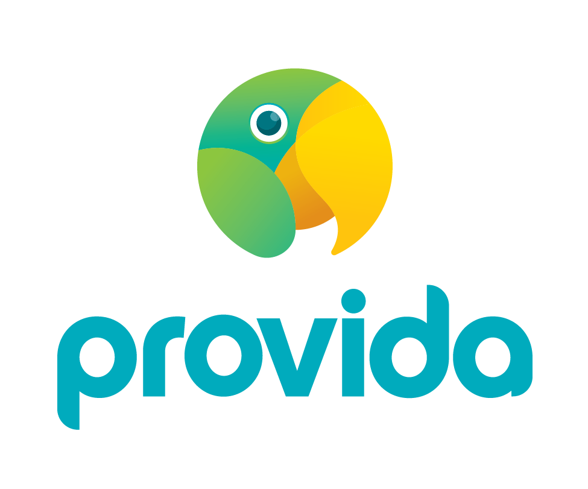

#### Links
 - Github: [Fallstop/react-pdf-image-qr-scanner](https://github.com/Fallstop/react-pdf-image-qr-scanner)
 - NPM: [react-pdf-image-qr-scanner](https://www.npmjs.com/package/react-pdf-image-qr-scanner)
 - Demo: [Demo](https://react-pdf-qr-scanner.pages.dev/)
 - Sponsor: [Provida](https://www.provida.nz/)

### React library to scan user-uploaded PDF's locally for QR codes.

This library is a simple way to scan user-uploaded PDF's and images for QR codes on the client-side. It uses PDF.js to render the PDF and jsQR to scan the image and PDF canvas data.

#### Use Case - NZ “My Vaccine Pass”

Provida has healthcare companies as its main clients. Due to vaccination mandates in healthcare in NZ, these customers need to request and store Covid vaccination status for all of their staff and contractors.

Provida has already implemented a “My Vaccine Pass” QR Code reader solution for this. However we have found that our users don’t always have the QR Code available on their phone, or for whatever reason are unable to scan it successfully, e.g. due to low quality camera or just shaky hands!

This was made to be a backup method to upload their vaccination status. It uses the PDF vaccination status document that is emailed out by MoH on receiving the second booster. This has the QR Code embedded in it. The user uploads their PDF document to our application, and we’d parse out the QR Code and decode it automatically, running it through NZCP.js as normal to verify the signature.

 
 
<h3 align="center">
	Supported By
</h3>

